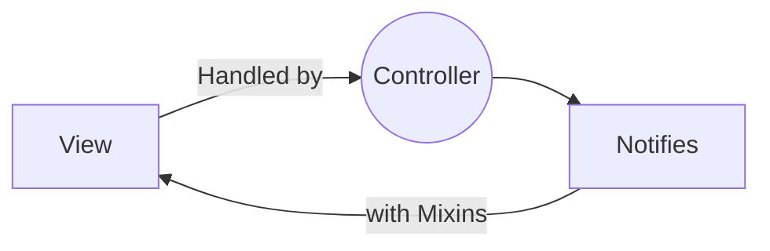
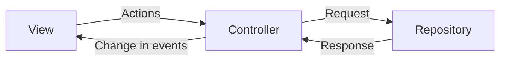

# getx_clean_architecture

Getx Clean Architecture

## Getting Started

This project consists of following Packages

- [Get](https://pub.dev/packages/get) - state management
- [Dio](https://pub.dev/packages/dio)  -  network handler

### Pattern
#### Approach 1

#### Approach 2



#### UI Screen

```
controller.obx(  
    (flowers) => buildListViews(flowers!),  
    onLoading: Loading(),  
    onError: (error) => Text("ERROR ${error}"),  
  ),  
)
```

#### Controller
```
getFlowers() async{  
  change(flowers, status: RxStatus.loading());  
  try {  
    var response = await ApiServices().get(ApiUrl.flowers);  
    flowers.value = FlowerList.fromJson(response).flowerLists;  
    change(flowers.value, status: RxStatus.success());  
  }catch (e) {  
    change(flowers.value, status: RxStatus.error("Server Error"));  
  }  
}
```
#### API Service (Repository)

```
class ApiServices {  
  Future<dynamic> get(url) async {  
    var dio = Dio();  
    dio.interceptors.add(  
        LogInterceptor(responseBody: true, request: true, requestBody: true));  
    try {  
      var response = await dio.get(ApiUrl.baseUrl + url);  
      return response.data;  
    } on DioError catch (e) {  
      throw Exception(e);  
    }  
  }  
}
```

